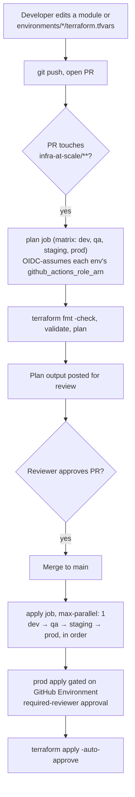
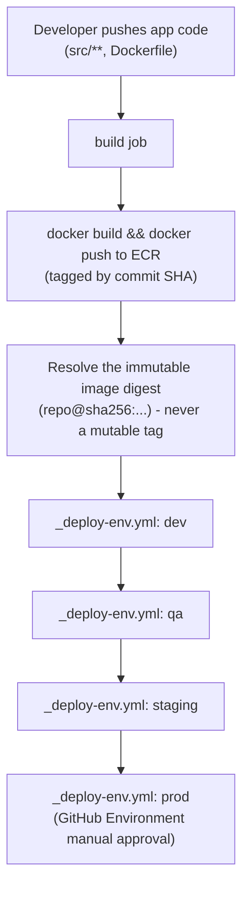
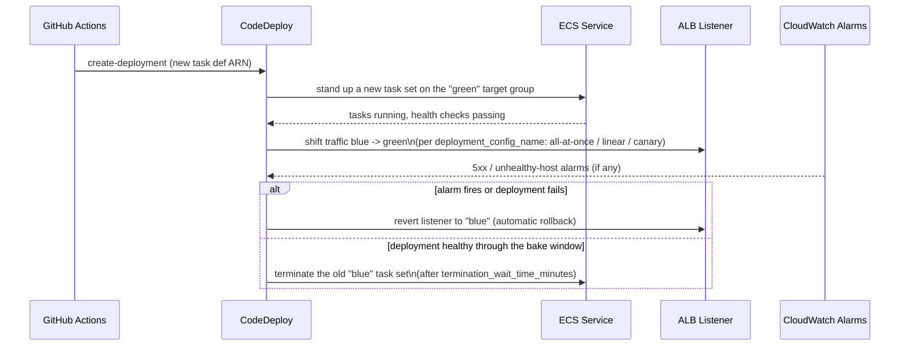

# Git → deployment flow

There are two independent pipelines in this repo, triggered by different
paths in the same Git history: **infrastructure changes** (anything under
`infra-at-scale/**`) and **application changes** (anything under the app's
own source tree, e.g. `src/**`). They share the same authentication
mechanism (GitHub OIDC — no long-lived AWS keys anywhere) and the same
promotion order (`dev → qa → staging → prod`), but they run as separate
GitHub Actions workflows. Both are defined as inert templates in
[`../ci-cd/github-actions/`](../ci-cd/github-actions/) — copy them into
`.github/workflows/` at the repo root to activate.

## 0. One-time bootstrap (before either pipeline can run)

```
bootstrap/ (terraform apply, once per AWS account)
    │
    ▼
S3 state bucket + DynamoDB lock table + KMS key
    │
    ▼
environments/<env>/backend.hcl filled in with those outputs
    │
    ▼
environments/<env>/terraform.tfvars: every CHANGE_ME placeholder replaced
    │
    ▼
terraform init -backend-config=backend.hcl && terraform apply   (manual, first time)
```

The very first `apply` per environment is manual — it creates the
`iam-github-oidc` role, the ECS services, and the CodeDeploy applications
that the automated pipelines below then authenticate against and deploy
into. Nothing in `ci-cd/github-actions/` can run until this exists.

## 1. Infrastructure change flow (`terraform-plan-apply.yml`)



Every environment's Terraform state is independent (see `backend.hcl`), so a
`dev` apply cannot touch `prod` resources even if the workflow logic had a
bug — the blast radius is capped by which AWS account/state the assumed role
can reach, not just by pipeline ordering.

## 2. Application change flow (`ecs-blue-green-deploy.yml` + `_deploy-env.yml`)

This is the flow that actually exercises the blue/green machinery
`modules/ecs-service-bluegreen` and `modules/alb` built.



Each `_deploy-env.yml` run does the same four steps, against that
environment's own ECS service and CodeDeploy application:

1. **Describe** the current task definition (`aws ecs describe-task-definition`)
   — this is either Terraform's original revision or whatever the previous
   deploy registered; either way it's the template for the new one.
2. **Render + register** a new task definition revision with the freshly
   built image digest swapped in (`aws ecs register-task-definition`).
   This step alone does **not** deploy anything — ECS won't move traffic
   until CodeDeploy tells it to.
3. **Render an AppSpec** naming that new task definition revision and the
   container/port pair.
4. **`aws deploy create-deployment`** — this is the step that actually starts
   the blue/green cutover. From here, AWS CodeDeploy takes over:



The deployment config and bake/rollback window widen as you move toward
production — `dev`/`qa` use `CodeDeployDefault.ECSAllAtOnce` with a 5-minute
termination wait; `staging` and `prod` use linear/canary shifts with 15–30
minute windows (see each environment's `terraform.tfvars`). This is a
Terraform-level setting (`deployment_config_name`, `termination_wait_time_minutes`
on `modules/ecs-service-bluegreen`), not something the CI workflow decides —
so a pipeline bug can't accidentally skip the bake window in prod.

## 3. What Terraform does and doesn't own here

Terraform (via `modules/ecs-service-bluegreen`) provisions the CodeDeploy
application, deployment group, and the ECS service's **initial** task set.
It deliberately does *not* re-deploy on every `terraform apply` — the
resource has `lifecycle { ignore_changes = [task_definition, load_balancer, desired_count] }`
specifically so that CodeDeploy, not Terraform, owns every deployment after
day one. Running `terraform apply` with a new `container_image` value in
`terraform.tfvars` only changes what the *next* CodeDeploy deployment would
start from if one were triggered manually — it does not itself cause a
cutover. Real deploys always go through step 2 above.

## 4. Promotion, not rebuild

Both flows promote the **same artifact** through every environment — the
infra pipeline applies the same module code with per-environment `tfvars`;
the app pipeline promotes the same image **digest** (not tag) from dev
through to prod. Nothing is rebuilt per environment, so "it worked in
staging" means the literal bytes that ran in staging are what reach prod.
