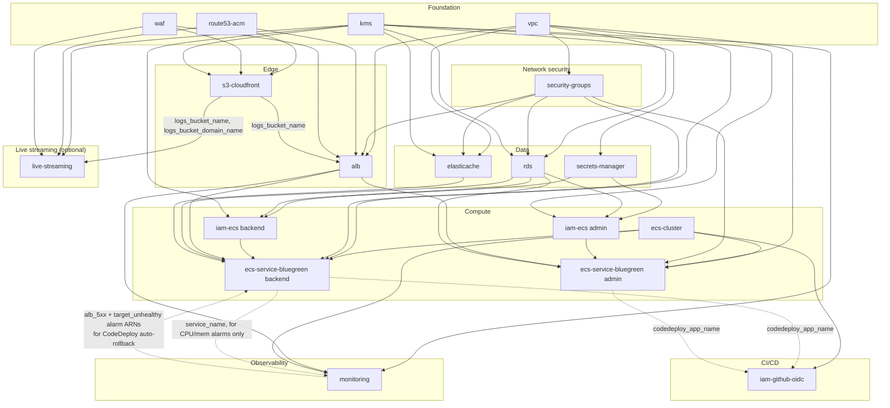

# How the modules connect

Every `environments/{dev,qa,staging,prod}/main.tf` wires the same 16 modules
together the same way — only `terraform.tfvars` differs per environment. This
doc describes that one wiring diagram once, plus the reasoning behind the
handful of non-obvious edges (module pairs that reference each other's
outputs without forming a dependency cycle).

## Dependency graph

## Reading the graph

- **Foundation modules** (`kms`, `vpc`, `route53-acm`, `waf`) have no
  dependencies on anything else in this repo — they're the first four
  `apply`d (Terraform's own graph parallelizes what it can regardless of file
  order, but conceptually these are "layer 0").
- **`security-groups`** only needs the VPC ID — every SG rule inside it
  references *other* SGs it creates itself (ALB → ECS tasks → RDS/Redis), not
  external modules, which is why the module owns all four SGs together
  instead of being split one-module-per-tier.
- **Solid arrows** are ordinary Terraform data dependencies (`module.x.output`
  passed as `module.y`'s input) — `terraform graph` would show the same
  edges.
- **Dotted arrows** between `monitoring` and `ecs-service-bluegreen backend`
  are the one pair worth explaining explicitly, because it looks like a
  cycle and isn't:
  - `monitoring` needs `ecs_backend.service_name` for its ECS CPU/memory
    alarms and dashboard widgets.
  - `ecs_backend`'s CodeDeploy deployment group needs `monitoring`'s ALB
    5xx/unhealthy-host alarm ARNs, to auto-rollback a bad blue/green
    deployment.
  - These are different *resources* inside each module. Terraform's
    dependency graph is per-resource, not per-module: the alarm resources
    `monitoring` hands to `ecs_backend` (`alb_5xx`, `target_unhealthy`) only
    reference `alb`'s outputs, never `ecs_backend`'s — so there's no resource
    that depends on itself transitively. See the comment above the
    `monitoring` module block in any `environments/*/main.tf` for the same
    explanation in-repo.
- **`ecs-service-bluegreen admin`** is deliberately *not* wired to
  `elasticache` or into `monitoring`'s auto-rollback alarms — the admin
  service doesn't need a cache, and only the customer-facing backend service
  has automatic rollback wired to ALB health (admin deploys roll back on
  `DEPLOYMENT_FAILURE` only, not on live traffic alarms, since not sending an
  admin-side rollback on backend traffic error rates keeps admin deploys from
  being blocked by unrelated frontend issues).
- **`live-streaming`** is the one subgraph with no edge into `Compute` or
  `Data` at all — it talks to S3 directly from MediaLive, never through the
  VPC, and is switched on/off per environment via `enable_live_streaming` in
  `terraform.tfvars` (off in `dev`, on in `staging`/`prod`). Its one edge into
  `Edge` isn't a request-path dependency, just a shared resource: the live
  CloudFront distribution's access logs and the HLS S3 bucket's access logs
  both land in the same log bucket `s3-cloudfront` already provisions for the
  frontend distribution and the ALB, rather than provisioning a fourth log
  bucket just for this optional module.
- **`iam-github-oidc`** sits downstream of everything it grants CI access to
  scope its IAM policy narrowly: it needs the ECS cluster ARN and both
  services' CodeDeploy application names to build a policy that can only
  register task definitions and start deployments for *this* environment's
  *these* specific resources — not `ecs:*`/`codedeploy:*` on everything in
  the account.

## Module → environment-variable mapping

Every module is generic (no environment name hardcoded inside `modules/`);
what makes `dev` differ from `prod` is entirely which values
`environments/<env>/terraform.tfvars` feeds into the same module calls:

| Varies by environment | Stays identical across environments |
| --- | --- |
| `azs` count (2 → 3 in prod), subnet CIDRs | Module source paths and wiring (`main.tf`) |
| `single_nat_gateway` (true in dev/qa, false in staging/prod) | Security group rules (always ALB→ECS→data, never wider) |
| `backend_min_capacity`/`max_capacity`, `db_instance_class`, `redis_max_ecpu_per_second` | KMS-encrypts-everything, WAF-in-front-of-everything |
| `deployment_config_name` (all-at-once → linear → canary) | CodeDeploy blue/green mechanics themselves |
| `db_multi_az`, `db_create_read_replica`, `enable_live_streaming` | Tag schema (`Project`, `Environment`, `ManagedBy`) |
| `github_allowed_ref` (any branch → `main`-only, narrowing toward prod) | OIDC-only CI auth (no static keys in any environment) |
