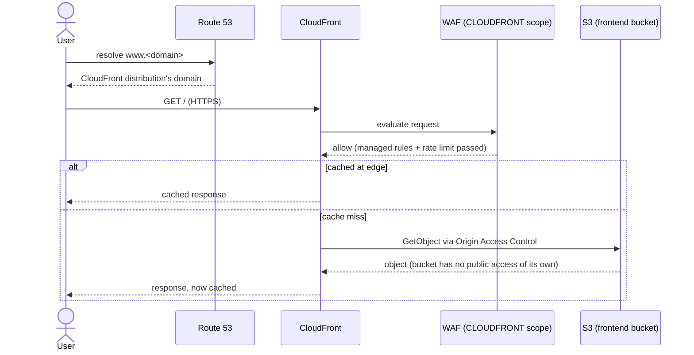
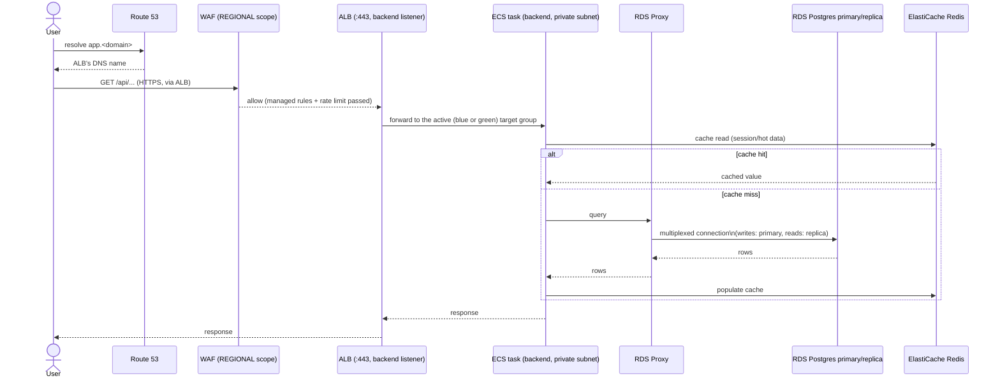
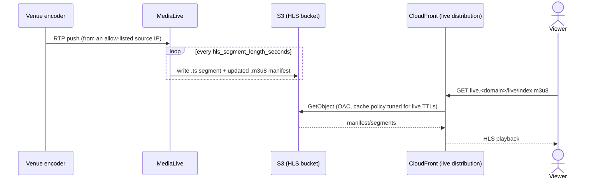
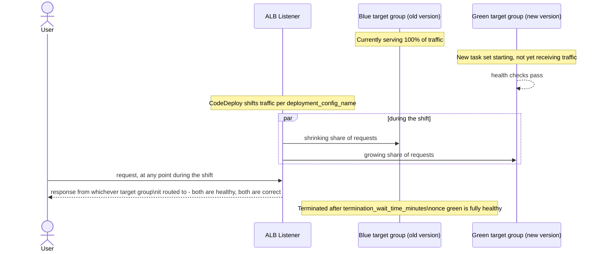

# User flow

Everything in `01-git-to-deployment-flow.md` and `02-module-connections.md`
exists to serve four kinds of real traffic. This doc walks each one from the
user's side of the wire.

## 1. A visitor loads the frontend

The S3 bucket (`modules/s3-cloudfront`) is never reachable directly — it has
`block_public_acls`/`block_public_policy` on and a bucket policy that only
trusts requests carrying CloudFront's own service-principal signature scoped
to *this* distribution's ARN. Every response is also forced through
`viewer_protocol_policy = "redirect-to-https"`, so there's no plain-HTTP path
to the frontend at all.

## 2. A visitor calls the API

Nothing in this path has a public IP except the ALB and NAT Gateways. The ECS
task, RDS Proxy, RDS instances, and Redis are all in private subnets,
security-group-scoped so that each tier can only be reached from the tier
directly above it (`modules/security-groups`) — a compromised ECS task can
reach the database, but nothing on the internet can reach the database
directly, and nothing can skip the proxy to hit RDS instances by IP from
outside the VPC.

## 3. An operator uses the admin service

Same shape as the API flow, but on a separate ALB listener
(`:8443`, `modules/alb`'s `services.admin` entry) with its own blue/green
target-group pair, its own ECS service, and its own IAM task role
(`modules/iam-ecs`, instantiated twice) — a credential or code issue in the
admin service has no path into the backend service's task role or vice
versa. The admin service intentionally has no ElastiCache wiring (it doesn't
need a cache) and isn't included in `monitoring`'s CodeDeploy auto-rollback
alarms (its rollback trigger is deployment failure only, not customer-facing
error-rate — see `02-module-connections.md`).

## 4. A viewer watches a live stream

This pipeline is intentionally decoupled from the VPC that serves 1 and
2 — MediaLive talks to S3 over AWS's own network, not through the app VPC's
NAT Gateway, so a live event's ingest traffic can't affect API/database
capacity and vice versa. It's also the one part of the stack that isn't
always running: MediaLive channels bill hourly whether or not a signal is
connected, so the channel is started/stopped per event rather than left on
(see `modules/live-streaming/README.md`).

## 5. What a user experiences during a deployment

This is the point of the whole blue/green setup: **nothing**, if it goes to
plan.

A user's request never hits a target group that hasn't passed its own health
checks (`modules/alb`'s `health_check` block on both target groups), and if
CloudWatch alarms fire mid-rollout (elevated 5xx, unhealthy hosts —
`modules/monitoring`), CodeDeploy reverts the listener back to the "blue"
target group automatically, before most users would notice a degraded
version was ever live. The one moment this isn't fully invisible: `staging`
and `prod` deploys shift gradually (`ECSLinear10PercentEvery1Minutes` /
`ECSCanary10Percent15Minutes`), so a small percentage of users are on the new
version before everyone is — by design, so a bad deploy affects 10% of
traffic for a few minutes, not 100% of traffic immediately.
